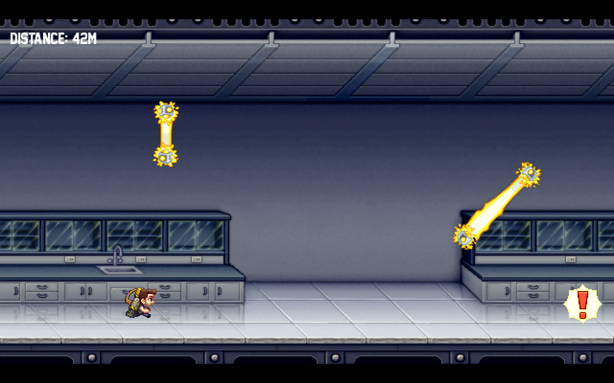

# Jetpack Joyride in C++

This project is a C++ implementation of the popular game Jetpack Joyride. It uses the SFML library for graphics and audio, and Box2D for physics simulation.



## Installation

1. Clone the repository:

   ```sh
   git clone https://github.com/huytrinhm/jetpack-joyride.git
   cd jetpack-joyride
   ```

2. Install dependencies:

   - Download and extract [SFML-2.6.2](https://www.sfml-dev.org/download.php) to the `external` directory.
   - Build [Box2D](https://github.com/erincatto/box2d) and place its `include` and `lib` in the `external/box2d` directory.

3. Build the project:
   ```sh
   make
   ```

## Usage

Run the game executable:

```sh
./build/game
```

## Project Structure

```
.gitignore
.vscode/
assets/
build/
external/
include/
src/
Makefile
README.md
```

- **assets/**: Contains game assets such as textures and fonts.
- **build/**: Directory where the compiled binaries and object files are stored.
- **external/**: Contains external libraries (SFML and Box2D).
- **include/**: Header files for the project.
- **src/**: Source files for the project.
- **Makefile**: Build script for the project.
- **README.md**: This file.

## Dependencies

- [SFML](https://www.sfml-dev.org/) - Simple and Fast Multimedia Library
- [Box2D](https://github.com/erincatto/box2d) - 2D Physics Engine

## Disclaimer

This project is for educational purposes only. It is not affiliated with Halfbrick Studios or the original Jetpack Joyride game. All intellectual property rights of the original game and its assets belong to their respective owners. This project does not aim to infringe on any copyrights and is not intended for distribution or sale. No financial profit is being made from this project.
All assets is [taken from the original game apk](https://gist.github.com/huytrinhm/fe37a6fa01f97275d74245920c36d858).
